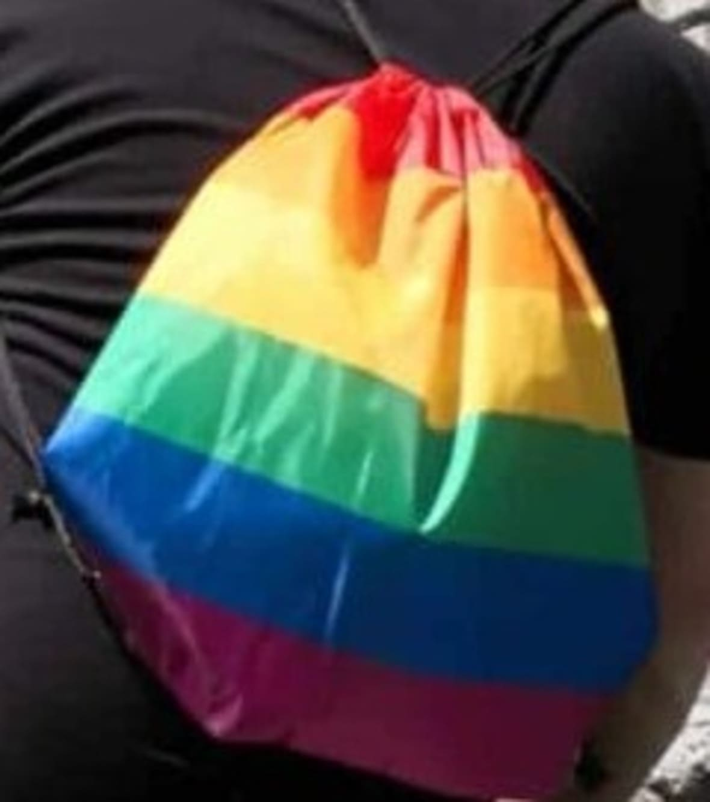

+++
title = "Homophobie in der Gesellschaft"
date = "2023-03-17"
draft = false
pinned = false
tags = ["Sexualität"]
image = "ori-2-2.jpg"
description = ""
+++
 Wie beeinflusst die sexuelle Orientierung die Gesellschaft? In der Schweiz gibt es 500.000 Menschen, die schwul, lesbisch oder bisexuell sind - Kishore ist einer von ihnen. Hier ist seine Geschichte. 



Samstagmorgen im Wankdorf Center. Normalerweise wimmelt es hier von Menschen, aber heute herrscht Stille. Kein Kinderlachen, kein Gemurmel von Passanten und kein Rattern der Kassiermaschinen ist zu hören. Die Läden sind geöffnet, aber es gibt kaum Besucher. Am Café Sapori d'Italia kreuzt ein junger Mann auf. Es ist Kishore. Er ist dezent gekleidet und trägt eine Tasche mit einem Regenbogen-Muster. Obwohl er auf den ersten Blick schüchtern und nervös wirkt, begrüsst er mich herzlich. Kishore geht zur Kellnerin und bestellt zwei Kaffees zum Hiertrinken. Dann bietet er mir einen Platz an und setzt sich mir gegenüber. "Ich finde es gut, dass Sie das Thema Homosexualität aufgreifen", sagt er zu mir.

 Rund zehn Prozent aller Erwachsenen in der Schweiz halten Homosexualität für unmoralisch. Das zeigt eine neue Untersuchung.                                                                                                                            

#### **Meine ersten Gefühle**

> Als Kind habe ich mich gerne geschminkt und ich stehe auch dazu.

Kishore war 15 Jahre alt, als ihm zum ersten Mal auffällt, dass er Gefühle für einen Jungen empfindet. Während Wochen verfolgt ihn diese Unsicherheit. Kishore sucht nach Gesprächen mit seinen Freunden, aber erfolglos. Keiner ist offen für ein Gespräch. Nicht nur Kishore fiel es schwer, offen über seine sexuelle Orientierung zu sprechen. Vielen Jugendlichen geht es genauso, aus Angst vor Prügel, verbalen Attacken sowie Hassbriefen.

#### **Zusammen sind wir stark**

> Meine Eltern waren für mich da, als ich niemanden hatte.

Seine Eltern würde er eher als lockere, entspannte Menschen beschreiben, die dieses Thema auch eher locker aufgenommen haben. Beim Abendessen unterhält er sich gelegentlich mit seiner Familie über Themen wie Sexualität und Verhütung. Eines Abends beschloss er, offen über seine sexuelle Orientierung zu sprechen und äusserte seine Gefühle, die er für einen Jungen empfindet.

Die Menschenmenge im Wankdorf Center wächst langsam an und die Luft wird dichter. Ein Mann in einem YB-Trikot eilt an uns vorbei. "Heute spielt YB", höre ich zwei Frauen sagen. Währenddessen schlürft Kishore seinen Kaffee. Trotz des Trubels um uns herum bleibt Kishore ruhig und entspannt. Wir unterhalten uns weiter.

> Auch durch die LGBT-Bewegung werden Homosexuelle immer mehr als Menschen akzeptiert.

 Die LGBT-Bewegung setzt sich für die Gleichberechtigung und Anerkennung von Lesben, Schwulen, Bisexuellen und Transgender-Personen ein. Sie kämpft gegen Diskriminierung und setzt sich für die rechtliche Anerkennung von gleichgeschlechtlichen Partnerschaften ein. Die Bewegung hat in vielen Ländern zur Legalisierung der gleichgeschlechtlichen Ehe beigetragen und setzt sich auch für die Akzeptanz von Transgender-Personen ein.

Auch in der Schweiz kommt die Akzeptanz von Homosexuellen langsam in Gang. Am 26. September 2021 wurde darüber abgestimmt, ob die Ehe auch für gleichgeschlechtliche Paare geöffnet werden soll. Die Schweiz hat mit Ja entschieden. Mit einem Ergebnis von 64,1 % zu 35,9 % wurde diese Abstimmung angenommen.                                                                                                                                                          

#### **Unter falschen Freunden**

> Menschen, die du jahrelang Freunde nennst und dich in schwierigen Zeiten nicht unterstützen, sind keine wahren Freunde.

Das Gespräch wird plötzlich emotional und Kishore fängt an zu weinen. Es ist offensichtlich, dass die Frage ihn mitnimmt und er noch nicht vollständig damit abgeschlossen hat. Kishore erzählt, dass er in seiner Jugend viele Freunde hatte und jeder ihn auf dem Pausenhof kannte. Doch nachdem er sich geoutet hatte, änderte sich alles. Seine engsten Freunde wandten sich von ihm ab, von denen er am wenigsten erwartet hatte, dass sie ihn nicht unterstützen würden. "Das war eine schwere Zeit für mich", sagt Kishore.

#### **Hoffnung für alle**

Vor dem Wankdorf-Stadion sehe ich eine grosse Gruppe von YB-Fans, die sich auf das Spiel vorbereiten. Das Gespräch mit Kishore neigt sich dem Ende zu. Zum Abschluss unseres Gesprächs teilt Kishore seine Gedanken zur Zukunft: "Ich wünsche mir Frieden auf der ganzen Welt und dass jeder Mensch so akzeptiert wird, wie er ist", sagt er mit ruhiger Stimme. Sein Wunsch ist ein wichtiger Aufruf zur Toleranz und Akzeptanz gegenüber aller Menschen, unabhängig von ihrer sexuellen Orientierung oder Geschlechtsidentität. Kishores Worte zeigen, wie wichtig es ist, dass wir uns gemeinsam für eine Welt einsetzen, in der jede Person respektiert und anerkannt wird. Ich bedanke mich bei Kishore für seine Offenheit und seinen Mut, seine Geschichte zu teilen. Seine Erfahrungen und Ansichten haben mich tief berührt und inspiriert.

 Homophobie wird in den Sozialwissenschaften zusammen mit Phänomenen wie Rassismus, Xenophobie oder Sexismus unter dem Begriff „gruppenbezogene Menschenfeindlichkeit“ gefasst. Als Lesbophobie wird ein sich mit Homophobie überschneidendes, sexistisches Verhalten gegenüber lesbischen Frauen bezeichnet und charakterisiert eine doppelte Diskriminierung der davon betroffenen Frauen. 

Bei Homophobie gibt es viele Einflussfaktoren, die für Vorurteile und Diskriminierung allgemein gelten: Es gibt sehr viel Forschung dazu, warum Menschen andere Gruppen abwerten. Unter anderem hat es etwas mit dem internalisierten Schubladendenken zu tun. Menschen müssen ihre Umwelt vereinfachen und kategorisieren, um sie verstehen zu können, das macht unser Gehirn schon von ganz allein.                                               



Kishore Tharmalingam (17), er lebt in Ittigen, macht eine Ausbildung als Elektriker und kommt ursprünglich aus Sri Lanka.  

